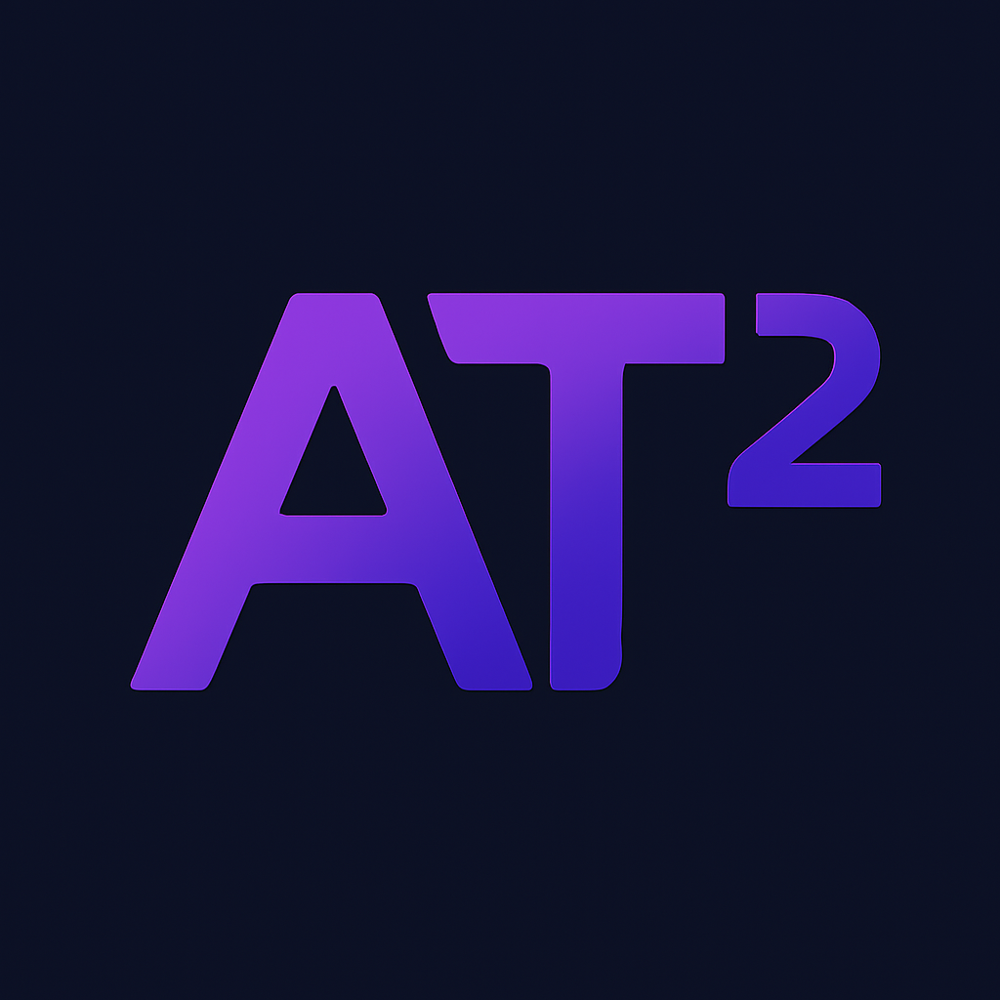

# AT2: Learning to Attribute with Attention

<p align='center'>
    
    <br>
    [<a href="#getting-started">getting started</a>]
    [<a href="#tutorials">tutorials</a>]
    [<a href="#citation">bib</a>]
    <br>
    Maintained by <a href="https://twitter.com/bcohenwang">Ben Cohen-Wang</a>
</p>

`at2` is a method for using attention to pinpoint the specific information that a language model *uses* when generating a particular statement.
This "information" can be, for example, a user-provided context, search results relevant to a query, or the models own intermediate thoughts.
When attributing a generated statement to context, the attributed sources can be interpreted as *citations* for the statement (see [ContextCite](https://github.com/MadryLab/context-cite)).

The attention mechanism 

## Getting started

## Tutorials

We provide a few notebooks to walk through the different functionalities of AT2.
AT2 *learns* to attribute a particular model's generation to preceding tokens.

- [**Training AT2**](https://github.com/MadryLab/AT2/blob/main/notebooks/train_at2.ipynb): Training AT2 to attribute the generations of [`Phi-4-mini-instruct`](https://huggingface.co/microsoft/Phi-4-mini-instruct).
- [**Multi-document context attribution**](): 
- [**Thought attribution**](): 

## Citation
```bib
TODO
```